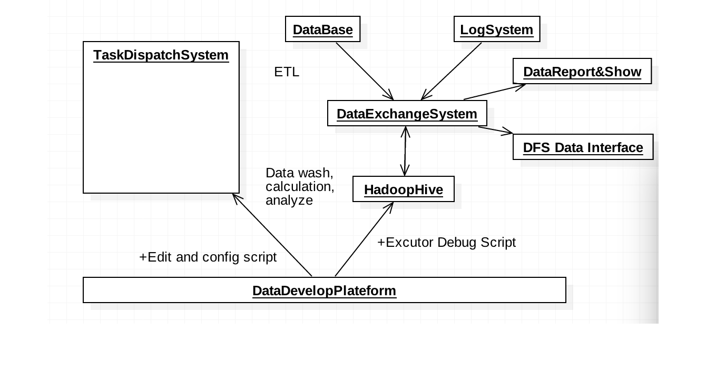
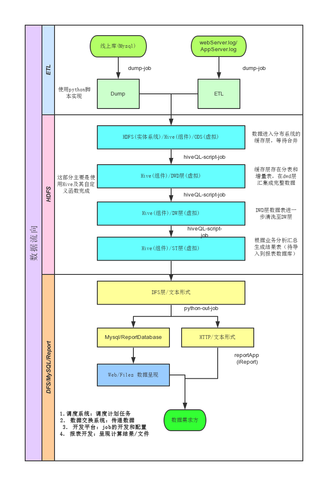

#BigData Plateform Introduce

以Hadoop为基础框架，选择hive类SQL的语言特点，采用了cloudera的CDH集成，数据交换系统（ETL），集成开发环境，任务调度系统，报表开发与展示应用以及报表权限管理系统

##Architecher

数据平台主要由 数据开发平台（XRay），数据交换系统，任务调度系统，报表开发&展示系统 组成，基础架构则是hadoop，批处理任务使用的是hive组件。

各子系统的功能介绍：

*	数据交换系统

将线上Mysql库和线上Web服务器和APP后台服务器的日志分别经过数据交换系统导入或解析入hive中的数据缓存层。等待清洗和处理。

*	集成开发环境

对于数据的批处理脚本的开发，调试以及管理都在该平台完成，数据开发平台web-IDE的形式更加方便地对hiveQL脚本 进行管理和配置，同时也方便了团队成员和外部部门间的协作开发。

*	任务调度系统

离线分析系统的突出特点是通过计划任务执行分析脚本，任务往往放在每天凌晨定时执行，此时前一天的数据已经完成，任务调度系统根据开发平台中配置的脚本定时时间以及脚本间的依赖关系，开始创建执行计划队列，并对执行进度和报错做记录，及时反馈给相关脚本开发人员。

*	报表系统

包括 报表开发，报表展示以及权限管理模块，将离线分析结果以报表或图形的形式展示出来。权限管理则根据各部门或个人的权限以RBAC方式授权报表对应的读写权限。

##Object Diagram

##Data stream

线上数据库以及线上服务器日志，经过数据交换系统配置的ETL脚本将数据解析到分析平台 HDFS内，通过hive加载，创建结构化的hive表以分布式方式存储。

ETL工作完成，经数据开发平台创建，编辑和配置的hive脚本对数据仓库中的数据进行批处理，由于依赖关系，优先级以及配置的执行时间不同，任务调度系统对会提前生成计划队列，依次触发队列中的任务，并及时跟踪捕捉任务执行的状态，执行时长，以及任务抛出的异常等等信息，生成可查询的记录。

当任务执行出错时，调度系统会自动重启该任务，连续两次重启执行仍失败，则根据配置的报警短信接收人发送异常短信，当前为异常发生时，每分钟发送一条短信，直至关闭短信提醒。批处理任务完成，生成计算结果表之后，会再次通过 数据交换系统 导出到报表库或DFS(http)中，供需求方使用。

导出到DFS的数据可以使用http请求的方式获得数据，而导出到报表库中的数据可以使用 报表开发&展示系统，将数据配置为报表或图表，在web中展示出来。

