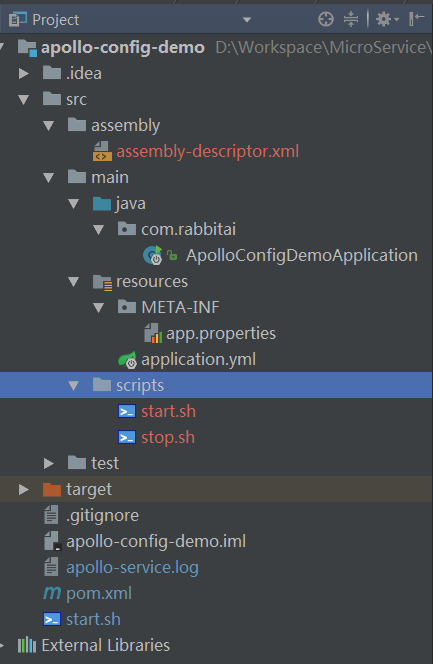

#### Spring Boot 服务化打包方案

##### 为什么需要服务化打包方案

随着后端服务向微服务方向发展，后端服务逐步使用容器化部署方案，需要一个统一的工程化的打包部署方案

##### 使用 assembly 插件打包 SpringBoot 项目

* 使用 assembly 插件的文件树结构图如下



* POM 文件内容如下：

```
<?xml version="1.0" encoding="UTF-8"?>
<project xmlns="http://maven.apache.org/POM/4.0.0" xmlns:xsi="http://www.w3.org/2001/XMLSchema-instance"
	xsi:schemaLocation="http://maven.apache.org/POM/4.0.0 http://maven.apache.org/xsd/maven-4.0.0.xsd">
	<modelVersion>4.0.0</modelVersion>

	<groupId>com.rabbitai</groupId>
	<artifactId>apollo-config-demo</artifactId>
	<version>0.0.1-SNAPSHOT</version>
	<packaging>jar</packaging>

	<name>apollo-config-demo</name>
	<description>Demo project for Spring Boot</description>

	<parent>
		<groupId>org.springframework.boot</groupId>
		<artifactId>spring-boot-starter-parent</artifactId>
        <version>1.5.4.RELEASE</version>
		<relativePath/> <!-- lookup parent from repository -->
	</parent>

	<properties>
		<project.build.sourceEncoding>UTF-8</project.build.sourceEncoding>
		<project.reporting.outputEncoding>UTF-8</project.reporting.outputEncoding>
		<java.version>1.8</java.version>
	</properties>

	<dependencies>
		<dependency>
			<groupId>org.springframework.boot</groupId>
			<artifactId>spring-boot-starter</artifactId>
		</dependency>

		<dependency>
			<groupId>org.springframework.boot</groupId>
			<artifactId>spring-boot-starter-test</artifactId>
			<scope>test</scope>
		</dependency>

		<dependency>
			<groupId>com.ctrip.framework.apollo</groupId>
			<artifactId>apollo-client</artifactId>
			<version>0.10.0-SNAPSHOT</version>
		</dependency>
		<dependency>
			<groupId>com.ctrip.framework.apollo</groupId>
			<artifactId>apollo-common</artifactId>
			<version>0.10.0-SNAPSHOT</version>
		</dependency>
        <dependency>
            <groupId>junit</groupId>
            <artifactId>junit</artifactId>
            <version>4.12</version>
            <scope>test</scope>
        </dependency>
    </dependencies>

	<build>
		<plugins>
		<plugin>
			<groupId>org.springframework.boot</groupId>
			<artifactId>spring-boot-maven-plugin</artifactId>
			<configuration>
				<executable>true</executable>
			</configuration>
		</plugin>
		<plugin>
			<artifactId>maven-assembly-plugin</artifactId>
			<version>3.0.0</version>
			<executions>
				<execution>
					<phase>package</phase>
					<goals>
						<goal>single</goal>
					</goals>
				</execution>
			</executions>
			<configuration>
				<descriptors>
					<descriptor>src/assembly/assembly-descriptor.xml</descriptor>
				</descriptors>
			</configuration>
		</plugin>
		<plugin>
			<groupId>org.apache.maven.plugins</groupId>
			<artifactId>maven-jar-plugin</artifactId>
			<configuration>
				<archive>
					<manifest>
						<addDefaultImplementationEntries>true</addDefaultImplementationEntries>
						<addDefaultSpecificationEntries>true</addDefaultSpecificationEntries>
					</manifest>
				</archive>
			</configuration>
		</plugin>
		<plugin>
			<groupId>org.apache.maven.plugins</groupId>
			<artifactId>maven-compiler-plugin</artifactId>
			<version>3.6.0</version>
			<configuration>
				<source>1.8</source>
				<target>1.8</target>
				<encoding>UTF-8</encoding>
			</configuration>
		</plugin>
		</plugins>
	</build>

</project>
```


其中 maven-assembly-plugin 插件用于项目打包，spring-boot-maven-plugin 用于创建可执行 jar 文件。


* start.sh 启动脚本内容示例如下

```
#!/bin/bash

./apollo-config-demo.jar
```

* Dockerfile 文件示例如下

```
FROM openjdk:8-jre-alpine

ENV VERSION 0.10.2

RUN echo "http://mirrors.aliyun.com/alpine/v3.6/main" > /etc/apk/repositories \
    && echo "http://mirrors.aliyun.com/alpine/v3.6/community" >> /etc/apk/repositories \
    && apk update upgrade \
    && apk add --no-cache procps unzip curl bash tzdata \
    && ln -sf /usr/share/zoneinfo/Asia/Shanghai /etc/localtime \
    && echo "Asia/Shanghai" > /etc/timezone

ADD apollo-config-demo.zip /apollo-config-demo/apollo-config-demo.zip

RUN unzip /apollo-config-demo/apollo-config-demo.zip -d /apollo-config-demo \
    && rm -rf /apollo-config-demo/apollo-config-demo.zip \
    && sed -i '$d' /apollo-config-demo/scripts/start.sh \
    && echo "tail -f /dev/null" >> /apollo-config-demo/scripts/start.sh

EXPOSE 8080

CMD ["/apollo-config-demo/scripts/start.sh"]
```


##### 附录

Spring Boot Maven Plugin (https://docs.spring.io/spring-boot/docs/current/reference/html/build-tool-plugins-maven-plugin.html)