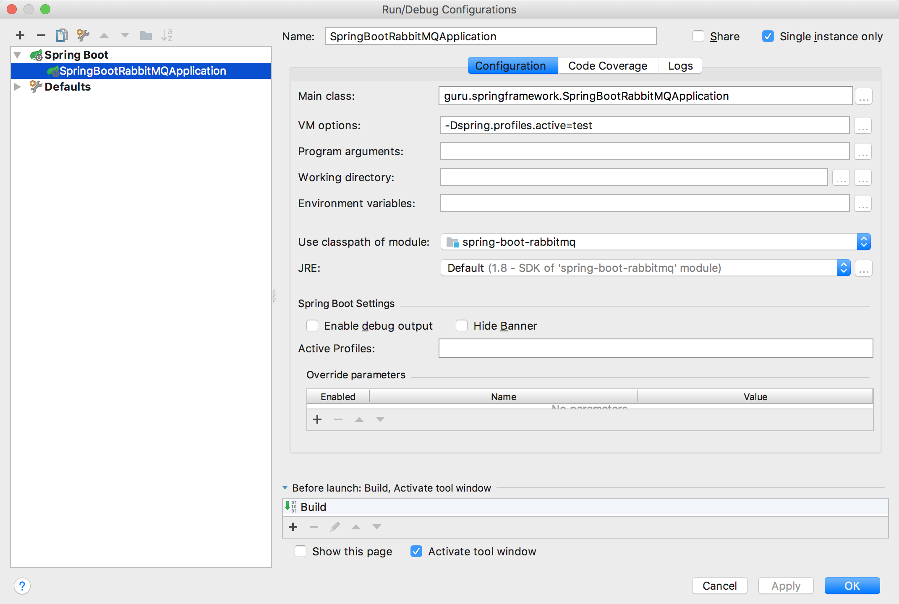

### Spring 多环境最佳实践

#### 使用配置文件做多环境配置

创建多个 application.properties，如 application-test.properties

如果使用 intellij ide 工具，设置运行参数如下：



> -Dspring.profiles.active=test

如果使用的是 SpringBoot，运行时会有如下输出：

```
2018-01-09 20:39:37.839  INFO 27667 --- [           main] g.s.SpringBootRabbitMQApplication        : Starting SpringBootRabbitMQApplication on tianyuan with PID 27667 (/Users/tianyuan/MicroServiceWorkspace/spring-boot-rabbitmq-example/target/classes started by tianyuan in /Users/tianyuan/MicroServiceWorkspace/spring-boot-rabbitmq-example)
2018-01-09 20:39:37.842  INFO 27667 --- [           main] g.s.SpringBootRabbitMQApplication        : The following profiles are active: test
```

