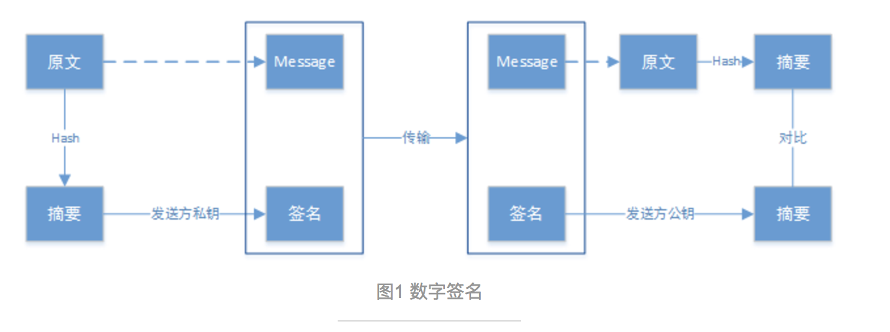
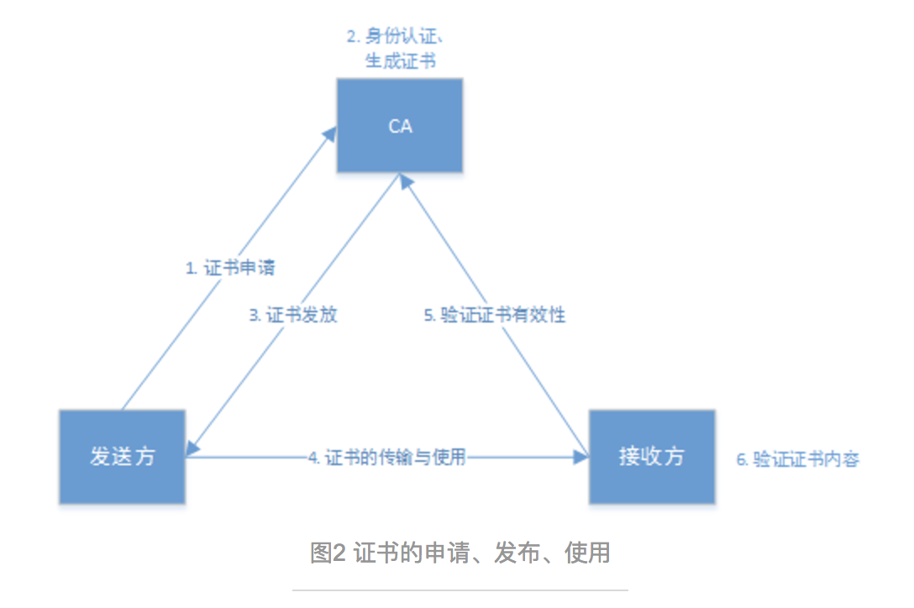
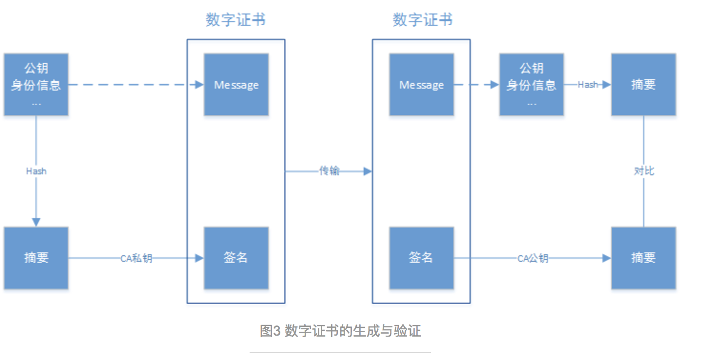
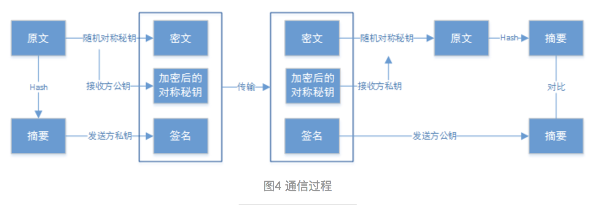
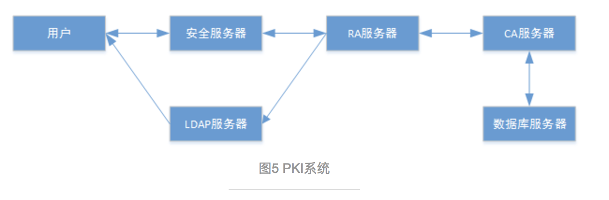

## PKI/CA工作原理及架构
### 相关概念

* PKI：Public Key Infrastructure，公钥基础设施。
* CA：Certificate Of Authority，认证中心。
* 数字证书：提供了一种发布公钥的简便途径；
* 一个数字证书包括：拥有者身份信息、公钥、CA数字签名、有效期等其他信息。
* 数字签名：用来确认信息发送者的身份，保证信息的完整性和抗否认性。

#### 数字签名

数字签名的生成：对于要传输的消息原文使用消息摘要算法（MD5、SHA）生成消息摘要，发送方使用自己的私钥对摘要进行加密，生成数字签名。

数字签名的验证：数字签名同消息一通传输给接收方，接收方对签名使用发送方的公钥解密还原摘要，并对得到的原文进行hash计算出消息摘要，比对两份消息摘要是否相同，可以保证消息的完整性和抗否认性。
用发送发私钥生成数字签名、用发送方公钥解密，可以证明消息确实是由公钥拥有者发出的。
两份摘要的比对结果，可以证明消息在传输的过程中是否被改动。

#### 数字证书

数字签名要发挥作用，首先需要接收方获取发送方的公钥。如何证明获取的公钥确实是发送方的公钥而不是假冒的呢？数字证书提供了一种发布公钥的简便方法。

简单地来说，把上面的原文换成公钥、身份信息、有效期等其他信息，就是数字证书的生成和验证过程。

数字证书的生成：CA收到数字证书申请并认证申请者的真实身份后，把申请者的公钥、身份信息、数字证书的有效期等信息作为消息原文，进行hash生成摘要，并用CA的私钥加密进行签名；数字签名与证书拥有者的公钥、身份信息、证书有效期等其他信息共同组成数字证书。

数字证书的验证：数字证书生成后，经历图2中3、4、5的传输过程，来到接收方。接收方收到消息证书后，使用CA公钥对数字签名解密生成消息摘要，对证书内容进行hash生成摘要，两份摘要进行比对可证明证书内容的完整性与真实性。

使用CA私钥进行签名和解密，可以证明证书确实是由CA发布的；
两份摘要的对比结果，可以证明证书内容是否在传输过程中被改动；
如果消息原文中的公钥和身份信息是CA的，则是CA自签名的过程。

注意：在实际应用过程中，有可能出现以下几种情况的攻击：
* 冒充服务提供者，使用未经过ca认证的数字证书；
* 截获其他正规渠道的经过ca认证的数字证书，直接使用；
* 截获其他正规渠道的经过ca认证的数字证书，修改证书中的公钥进行使用；

* 对于情况一：由于客户端会使用ca公钥进行解密，由于签名不是使用ca私钥进行签名的，那么使用ca公钥是无法解密的，最终计算的摘要肯定与hash计算的摘要不匹配；
* 对于情况二：对方身份是可以验证通过，但是后续通信过程中，由于服务放使用数字证书里面的公钥，但是没有对应的私钥，如果使用自己的私钥加密数据，客户端是没办法使用数字证书中的公钥进行解密的，此时通信失败；
* 对于情况三：修改数字证书里面的公钥，在摘要认证阶段就会失败；

通信过程

数字证书提供了一种发布公钥的简便途径，大家通过向CA申请认证发布自己的公钥，通过向CA验证来确认自己获得了别人的公钥。下图展示了通信双方互相获得公钥以后的通信过程。

* 发送方对要传输消息原文进行hash，生成消息摘要，用发送方的私钥生成数字签名；
* 随机生成对称秘钥，对原文加密，生成密文；
* 用接收方公钥加密对称秘钥；
* 将加密后的对称秘钥、数字签名与密文一通发送；
* 接收方收到后，用自己的私钥解密对称秘钥；
* 用对称秘钥解密密文，得到原文；
* 对原文hash得到摘要，用发送方的公钥解密签名得到摘要，对方两份摘要。
* 非对称加密安全性高，但计算量大效率低，因此使用对称秘钥对通信的主要内容进行加密；对称秘钥每次使用随机生成，用完即丢弃，降低风险；
* 用接收方公钥加密对称秘钥，保证了只有接收方才能对密文进行解密；
* 用发送发私钥进行签名，使得接收方可以验证消息的发送方和消息是否被修改过，保证了信息的完整性和抗否认性。

#### PKI/CA架构

完整的PKI/CA系统如下部分：

* 安全服务器：安全服务器面向普通用户，用于提供证书申请、浏览、证书撤销列表、证书下载等安全服务；* 用户需要首先得到安全服务器的证书（该证书由CA颁发）；
* 注册机构RA：在CA体系结构中起承上启下的作用，一方面向CA转发安全服务器传输过来的证书申请请求，另一方面向LDAP服务器和安全服务器转发CA颁发的数字证书和证书撤销列表（CRL）。
* LDAP服务器：Lightweight Directory Access Protocol（轻量目录访问协议），提供目录浏览服务，负责将注册机构服务器RA传输过来的用户信息以及数字证书加入到服务器上。用户通过访问LDAP服务器就能够得到其他用户的数字证书。
* CA服务器：整个证书机构的核心，负责证书的签发。CA首先 产生自身的私钥和公钥，然后生成数字证书，并且将数字正常传输给安全服务器。CA还负责为安全服务器、RA服务器生成数字证书。
* 数据库服务器：CA中的核心部分，用于CA中数据（如密钥和用户信息等）、日志、统计信息的存储和管理。

#### 证书申请过程

* 用户申请：用户获取CA的数字证书（根证书），与安全服务器建立连接；
生成自己的公钥和私钥，将公钥和自己的身份信息提交给安全服务器，安全服务器将用户的申请信息传送给RA服务器。
* RA审核：RA收到用户的申请，用户向RA证明自己的身份，RA进行核对。如果RA同意用户申请证书的请求，则对证书申请信息做数字签名；否则拒绝用户的申请。
* CA发行证书：RA将用户申请和RA签名传输给CA，CA对RA数字签名做认证，如果验证通过，则同意用户请求，颁发证书，然后将证书输出。如果验证不通过，则拒绝证书申请。
* RA转发证书：RA从CA得到新的证书，首先将证书输出到LDAP服务器以提供目录浏览，再通知用户证书发行成功，告知证书序列号，到指定的网址去下载证书。
* 用户证书获取：用户使用证书序列号去指定网址下载自己的数字证书，只有持有与申请时提交的公钥配对的私钥才能下载成功。

#### 证书撤销过程

* 用户申请：用户向RA发送一封签名加密邮件，申请撤销证书。
* RA审核：注册机构同意证书撤销，并对申请签名。
* CA更新CRL：CA验证证书撤销请求的RA签名，如果正确，则同意申请，并更新CRL，并输出。
* RA转发CRL：注册中心收到CRL，以多种方式将CRL公布（包括LDAP服务器）。
* 用户告知：用户访问LDAP服务器，下载或浏览CRL。

#### 证书的管理

认证中心CA负责维护和发布证书废除列表CRL（certificate revocation lists，又称为证书黑名单）。
当一个证书，特别是其中的公钥因为其他原因无效时（不是因为到期），CRL提供了一种通知用户和其他应用的中心管理方式。CA系统生成CRL以后，放到LDAP服务器中或Web服务器的合适位置，供用户查询或下载。