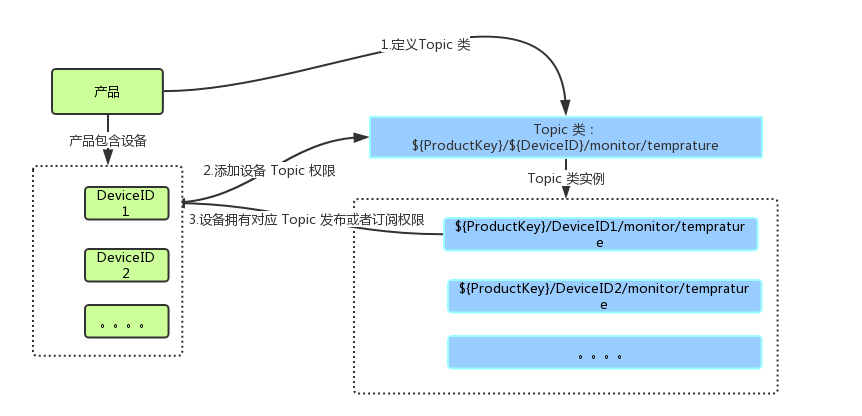

### Topic 规范

物联网平台中，服务端和设备端通过 Topic 来实现消息通信。Topic是针对设备的概念，Topic类是针对产品的概念。

#### 什么是Topic类？

为了方便海量设备基于海量 Topic 进行通信，简化授权操作，物联网平台增加了 Topic 类的概念。您创建产品后，物联网平台会为该产品自动创建默认的 Topic 类。并且，在您创建设备后，会自动将产品 Topic 类映射到设备上。您无需单独为每个设备授权 Topic。

图1.Topic 概览

在您创建产品后，物联网平台会自动为您的产品生成一些标准的 Topic 类。您可以在产品相关页面，查看该产品的所有 Topic 类。

关于 Topic 类的说明：

- Topic类是一类 Topic 的集合。例如，

  Topic 类：`${ProductKey}/${DeviceID}/monitor/temprature`是具体 Topic：`${ProductKey}/DeviceID1/monitor/temprature`和`${ProductKey}/DeviceID12/monitor/temprature`的集合。

- Topic类中必须以正斜线(/)进行分层，区分每个类目。其中，有两个类目为既定类目：`${ProductKey}`表示产品的标识符 ProductKey；`${DeviceID}`表示设备ID，在设备详情页面可以看到。

- 类目命名只能包含字母，数字和下划线(_)。每级类目不能为空。

- 设备操作权限：发布表示设备可以往 Topic 发布消息；订阅表示设备可以从 Topic 订阅消息。

- 基础版产品和高级版产品都支持自定义 Topic 类。您可以根据业务需求，通过自定义 Topic 类灵活地进行消息通信。

- 系统 Topic 类是由系统预定义的 Topic 类，不支持用户自定义，不采用`${ProductKey}`开头。例如,针对物模型所提供的 Topic 类一般以`sys/`开头；固件升级相关的Topic类以`ota/`开头；设备影子的 Topic 类以`shadow/`开头。

- Topic 不建议用 "/" 开头，请参见 <https://g.hz.netease.com/push-server/iot/iot-doc/wikis/topic>

#### 什么是Topic？

产品的 Topic 类不用于通信，只是定义 Topic。用于消息通信的是具体的 Topic。

* Topic 格式和Topic 类格式一致。区别在于 Topic 类中的变量`${DeviceID}`，在 Topic 中则是具体的设备 ID。设备对应的 Topic 是从产品 Topic 类映射出来，根据设备ID而动态创建的。设备的具体 Topic 中带有设备名称（即`DeviceID`），只能被该设备用于 Pub/Sub 通信。例如，Topic：`${ProductKey}/DeviceID1/update`归属于设备 ID 为 DeviceID1 的设备，所以只能被设备 DeviceID1 用于发布、订阅消息，而不能被设备 DeviceID2 用于发布订阅消息。

* 在配置规则引擎时，配置的 Topic 中可使用通配符，且同一个类目中只能出现一个通配符。

  表 1. Topic 通配符

  | 通配符  | 描述                                       |
  | ---- | ---------------------------------------- |
  | #    | 这个通配符必须出现在 Topic 的最后一个类目，代表本级及下级所有类目。例如， Topic：`ProductKey/DeviceID1/#`，可以代表`ProductKey/DeviceID1/monitor`和`ProductKey/DeviceID1/monitor/temprature`。 |
  | +    | 代表本级所有类目。例如，Topic：`ProductKey/+/monitor`，可以代表`${ProductKey}/DeviceID1/monitor`和`${ProductKey}/DeviceID2/monitor`。 |

  ​

#### Topic列表

物联网平台的Topic分为系统定义的Topic和自定义的Topic，本文主要列出了系统定义的Topic。

##### 基础版默认Topic类

创建基础版产品之后，系统自动创建三个默认的用户 Topic 类。

- `${ProductKey}/${DeviceID}/update`：用于设备上报数据。设备操作权限：发布。
- `${ProductKey}/${DeviceID}/update/error`：用于设备上报错误。设备操作权限：发布。
- `${ProductKey}/${DeviceID}/get`：用于设备获取云端数据。设备操作权限：订阅。

##### 系统相关 Topic 类

* `sys/${ProductKey}/#`：此 Topic 暂时预留

##### 设备影子相关Topic类

设备影子提供系统 Topic 类，主要用于基础版产品的影子更新。

* `shadow/update/${ProductKey}/${DeviceID}`：用于更新设备影子。设备和应用程序操作权限：发布。
* `shadow/get/${ProductKey}/${DeviceID}`：用于获取设备影子。设备操作权限：订阅。

##### 设备广播Topic类设备

广播提供系统Topic类，但是可以自定义广播设备范围。

* `broadcast/${ProductKey}/+`：用于设备接收广播消息。设备操作权限：订阅。通配符（+）可自定义为广播的设备范围。

##### 固件升级相关Topic类

固件升级提供系统Topic类，用于设备上报固件版本和接收升级通知。

* `ota/device/inform/${ProductKey}/${DeviceID}`：用于设备端上报固件版本给云端。设备操作权限：发布。
* `ota/device/upgrade/${ProductKey}/${DeviceID}`：用于设备端接收云端固件升级通知。设备操作权限：订阅。
* `ota/device/progress/${ProductKey}/${DeviceID}`：用于设备端上报固件升级进度。设备操作权限：发布。
* `ota/device/request/${ProductKey}/${DeviceID}`：设备端请求是否固件升级。设备操作权限：发布。