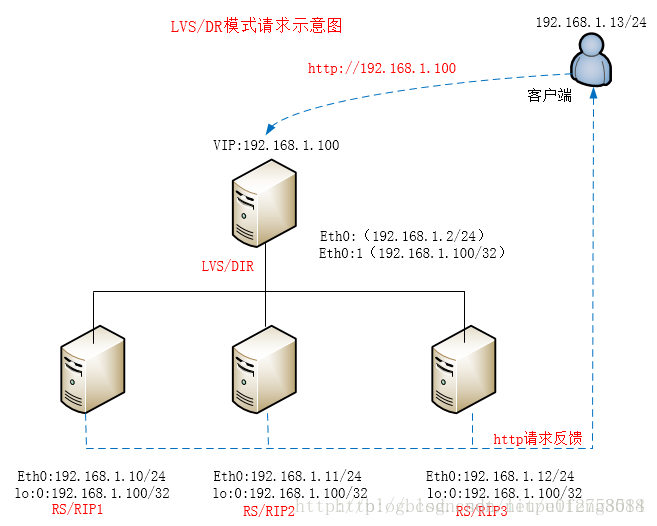

# LVS | LVS 负载均衡之工作原理说明（DR模式）

2018年01月11日 21:07:14

阅读数：889

> LVS-DR模式：每个Real Server上都有**两个IP**：VIP和RIP，但是**VIP是隐藏的，就是不能提供解析等功能，只是用来做请求回复的源IP的**，Director上只需要一个网卡，然后利用别名来配置两个IP：VIP和DIP，在DIR接收到客户端的请求后，DIR根据负载算法选择一台rs sever的网卡mac作为客户端请求包中的目标mac，通过**arp转交**给后端rs serve处理，**后端再通过自己的路由网关回复给客户端**。



CIP：192.168.1.13 
VIP：192.168.1.100 
DIR: 192.168.1.2 
RS ：192.168.1.10、192.168.1.11和192.168.1.12（提供http服务）

**整个请求过程示意：**

这里假设CIP的mac地址为：00-50-56-C0-00-08 ，DIR的Eth0的mac地址为：00-50-56-C0-00-01, RIP1的mac地址为: D0-50-99-18-18-15。**CIP在请求之前会发一个arp广播包，即请求“谁是VIP”,由于所有的DIR和RIP都在一个物理网络中，而DIR和RIP都有VIP地址，为了让请求发送到DIR上，所以必须让RIP不能响应CIP发出的arp请求**（这也是为什么RIP上要把VIP配置在lo口以及要仰制arp查询和响应）这时客户端就会将请求包发送给DIR，接下来就是DIR的事情了：

① client向目标vip发出请求，DiR接收。此时IP包头及数据帧头信息如下：

| src mac           | dst mac           | src ip       | src port | dst ip        | dst port |
| ----------------- | ----------------- | ------------ | -------- | ------------- | -------- |
| 00-50-56-C0-00-08 | 00-50-56-C0-00-01 | 192.168.1.13 | 10011    | 192.168.1.100 | 80       |

② DIR根据负载均衡算法选择一台active的RS（RIP1），将此RIP1所在网卡的mac地址作为目标mac地址，发送到局域网里。此时IP包头及数据帧头信息如下：

| src mac           | dst mac           | src ip       | src port | dst ip        | dst port |
| ----------------- | ----------------- | ------------ | -------- | ------------- | -------- |
| 00-50-56-C0-00-01 | D0-50-99-18-18-15 | 192.168.1.13 | 10011    | 192.168.1.100 | 80       |

③RIP1(192.168.1.10)在局域网中收到这个帧，拆开后发现目标IP(VIP)与本地匹配，于是处理这个报文。随后重新封装报文，发送到局域网。此时IP包头及数据帧头信息如下：

| src mac           | dst mac           | src ip        | src port | dst ip       | dst port |
| ----------------- | ----------------- | ------------- | -------- | ------------ | -------- |
| D0-50-99-18-18-15 | 00-50-56-C0-00-08 | 192.168.1.100 | 80       | 192.168.1.13 | 10011    |

如果client与VS同一网段，那么client(192.168.10.13)将收到这个回复报文。如果跨了网段，那么报文通过gateway/路由器经由Internet返回给用户。在实际情况下，可能只有一个公网，其他都是内网，这时VIP绑定地址应该是公网那个ip，或者利用路由器静态NAT映射将公网与内网vip绑定也行。

**LVS负载均衡模式—DR模式特点：**

1. 各RIP 必须与 DIP 在同一个网络中(相同的广播域)；
2. RS 的 RIP 可以使用私有地址，也可以使用公网地址，以方便配置；
3. 不支持支持端口映射；
4. RS可以使用必须为uninx操作系统（OS）；且RS需要仰制arp，需要在loopback配置vip；
5. Director 仅负责处理入站请求，响应报文由 Realserver 直接发往客户端；
6. Realserver 不能将网关指向 DIP，而直接使用前端网关响应请求报文；

**优点**：负载均衡器只负责将请求包分发给物理服务器，而物理服务器将应答包直接发给用户。所以，负载均衡器能处理很巨大的请求量，这种方式，一台负载均衡能为 超过100台的物理服务器服务，负载均衡器不再是系统的瓶颈。使用VS-DR方式，如果你的负载均衡器拥有100M的全双工网卡的话，就能使得整个 Virtual Server能达到1G的吞吐量。甚至更高；

**不足**：但是，这种方式需要所有的DIR和RIP都在同一广播域；不支持异地容灾。

**总结**：LVS-DR是三种模式中性能最高的一种模式，比LVS-NAT模式下负载的RS serve更多，通常在100台左右，对网络环境要求更高，也是日常应用的最多的一种工作模式。

------

**关于lvs-dr模式下一些疑问：**

**1、LVS/DR如何处理请求报文的，会修改IP包内容吗？**

vs/dr本身不会关心IP层以上的信息，即使是端口号也是tcp/ip协议栈去判断是否正确，vs/dr本身主要做这么几个事：

①接收client的请求，根据你设定的负载均衡算法选取一台realserver的ip； 
②以选取的这个ip对应的mac地址作为目标mac，然后重新将IP包封装成帧转发给这台RS； 
③在hash table中记录连接信息。

vs/dr做的事情很少，也很简单，所以它的效率很高，不比硬件负载均衡设备差多少，数据包、数据帧的大致流向是这样的：client –> VS –> RS –> client

**2、RealServer为什么要在lo接口上配置VIP？在出口网卡上配置VIP可以吗？**

既然要让RS能够处理目标地址为vip的IP包，首先必须要让RS能接收到这个包。在lo上配置vip能够完成接收包并将结果返回client。不可以将VIP设置在出口网卡上,否则会响应客户端的arp request,造成client/gateway arp table紊乱，以至于整个load balance都不能正常工作。

**3、RealServer为什么要抑制arp帧？**

我们知道仰制arp帧需要在server上执行以下命令，如下：

```
echo "1" >/proc/sys/net/ipv4/conf/lo/arp_ignore
echo "2" >/proc/sys/net/ipv4/conf/lo/arp_announce
echo "1" >/proc/sys/net/ipv4/conf/all/arp_ignore
echo "2" >/proc/sys/net/ipv4/conf/all/arp_announce1234
```

因为arp对逻辑口没有意义。实际上起作用的只有以下两条:

```
echo "1" >/proc/sys/net/ipv4/conf/all/arp_ignore
echo "2" >/proc/sys/net/ipv4/conf/all/arp_announce12
```

即对所有的物理网卡设置arp仰制。对仰制所有的物理网卡设置arp仰制是为了让CIP发送的请求顺利转交给DIR以及防止整个LVS环境arp表混乱，不然容易导致整个lvs不能工作。

**4、LVS/DR load balancer（director）与RS为什么要在同一网段中？**

lvs/dr它是在数据链路层来实现的，即RIP必须能够接受到DIR的arp请求，如果不在同一网段则会隔离arp，这样arp请求就不能转发到指定的RIP上，所以director必须和RS在同一网段里面。

**5、为什么director上eth0接口除了VIP另外还要配一个ip（即DIP）？**

如果是用了keepalived等工具做HA或者Load Balance,则在健康检查时需要用到DIP。 没有健康检查机制的HA或者Load Balance则没有存在的实际意义。

**6、LVS/DR ip_forward需要开启吗？**

不需要。因为director跟realserver是同一个网段，无需开启转发。

**7、director的vip的netmask一定要是255.255.255.255吗？**

lvs/dr里，director的vip的netmask 没必要设置为255.255.255.255，director的vip本来就是要像正常的ip地址一样对外通告的,不要搞得这么特殊。

**参考文章**

[LVS项目介绍](http://www.linuxvirtualserver.org/zh/lvs1.html) 
[LVS集群的体系结构](http://www.linuxvirtualserver.org/zh/lvs2.html) 
[LVS集群中的IP负载均衡技术](http://www.linuxvirtualserver.org/zh/lvs3.html) 
[LVS集群的负载调度](http://www.linuxvirtualserver.org/zh/lvs4.html)