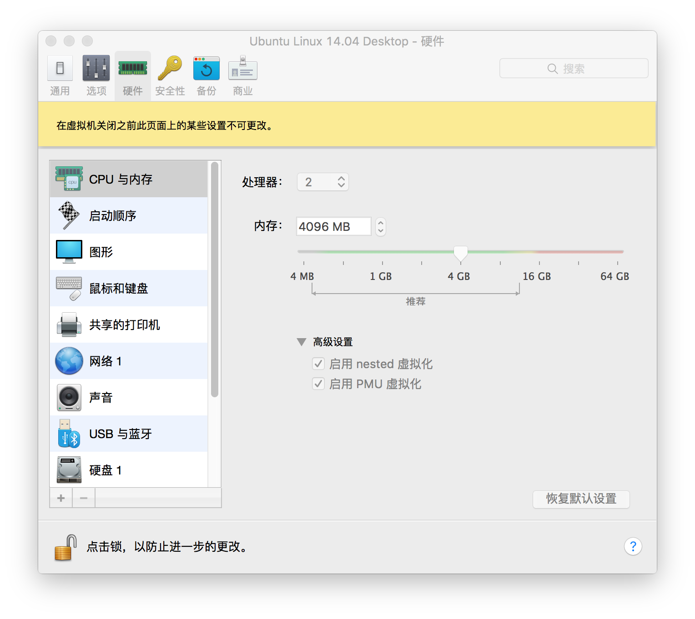
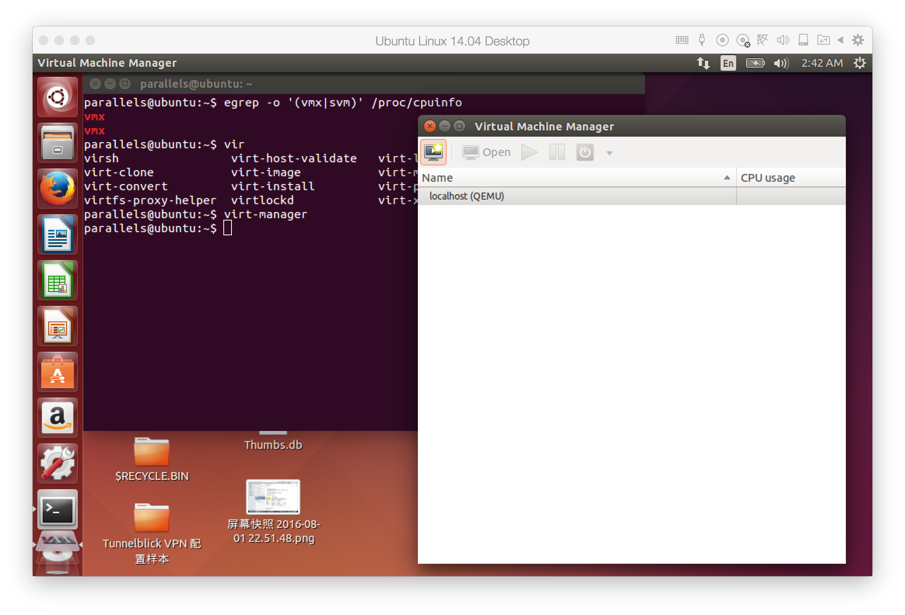

## 安装 kvm 依赖包

	sudo apt-get install qemu-kvm qemu-system libvirt-bin virt-manager bridge-utils vlan
	
```
qemu-kvm 和 qemu-system 是 KVM 和 QEMU 的核心包，提供 CPU、内存和 IO 虚拟化功能
libvirt-bin 就是 libvirt，用于管理 KVM 等 Hypervisor
virt-manager 是 KVM 图形化管理工具
bridge-utils 和 vlan，主要是网络虚拟化需要，KVM 网络虚拟化的实现是基于 linux-bridge 和 VLAN，后面我们会讨论。
```

## parallels 上使能  nested 虚拟化

		

> 注意，设置“启用 nested 虚拟化” 时，需要 ubuntu 虚拟机 shutdown，而不是挂起

## 创建第一个 KVM 虚拟机

$ virt-manager



*	获取 img 文件
	wget http://download.cirros-cloud.net/0.3.3/cirros-0.3.3-x86_64-disk.img
