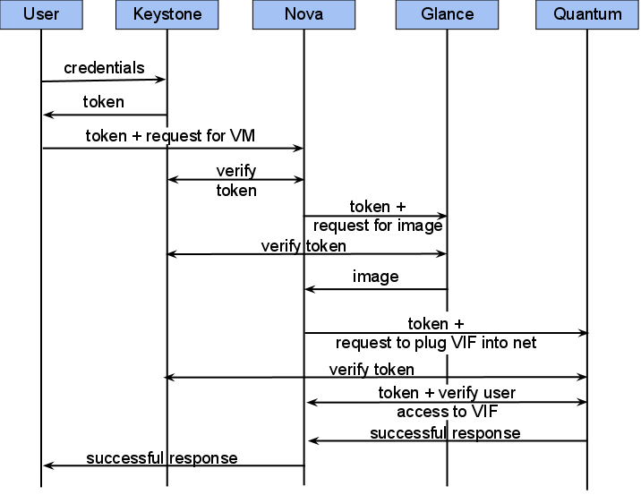

# OpenStack Keystone的基本概念理解

## Keystone简介

　　Keystone（OpenStack Identity Service）是OpenStack框架中，负责身份验证、服务规则和服务令牌的功能， 它实现了OpenStack的Identity API。Keystone类似一个服务总线， 或者说是整个Openstack框架的注册表， 其他服务通过keystone来注册其服务的Endpoint（服务访问的URL），任何服务之间相互的调用， 需要经过Keystone的身份验证， 来获得目标服务的Endpoint来找到目标服务。

## Keystone基本概念介绍

*	User

　　User即用户，他们代表可以通过keystone进行访问的人或程序。Users通过认证信息（credentials，如密码、API Keys等）进行验证。

*	Tenant

　　Tenant即租户，它是各个服务中的一些可以访问的资源集合。例如，在Nova中一个tenant可以是一些机器，在Swift和Glance中一个tenant可以是一些镜像存储，在Quantum中一个tenant可以是一些网络资源。Users默认的总是绑定到某些tenant上。

*	Role

　　Role即角色，Roles代表一组用户可以访问的资源权限，例如Nova中的虚拟机、Glance中的镜像。Users可以被添加到任意一个全局的 或 租户内的角色中。在全局的role中，用户的role权限作用于所有的租户，即可以对所有的租户执行role规定的权限；在租户内的role中，用户仅能在当前租户内执行role规定的权限。

*	Service

　　Service即服务，如Nova、Glance、Swift。根据前三个概念（User，Tenant和Role）一个服务可以确认当前用户是否具有访问其资源的权限。但是当一个user尝试着访问其租户内的service时，他必须知道这个service是否存在以及如何访问这个service，这里通常使用一些不同的名称表示不同的服务。在上文中谈到的Role，实际上也是可以绑定到某个service的。例如，当swift需要一个管理员权限的访问进行对象创建时，对于相同的role我们并不一定也需要对nova进行管理员权限的访问。为了实现这个目标，我们应该创建两个独立的管理员role，一个绑定到swift，另一个绑定到nova，从而实现对swift进行管理员权限访问不会影响到Nova或其他服务。

*	Endpoint

　　Endpoint，翻译为“端点”，我们可以理解它是一个服务暴露出来的访问点，如果需要访问一个服务，则必须知道他的endpoint。因此，在keystone中包含一个endpoint模板（endpoint template，在安装keystone的时候我们可以在conf文件夹下看到这个文件），这个模板提供了所有存在的服务endpoints信息。一个endpoint template包含一个URLs列表，列表中的每个URL都对应一个服务实例的访问地址，并且具有public、private和admin这三种权限。public url可以被全局访问（如http://compute.example.com），private url只能被局域网访问（如http://compute.example.local），admin url被从常规的访问中分离。

　　=================== 引用 Aaron 的理解=====================

　　keystone 里面的概念很多，有：User，Credentials，Authentication，Token，Tenant，Service，Endpoint，Role。在这么多概念中，其实最主要的就是 User 和 Tenant 。由于一些安全，服务问题，才引发了其它的概念。
　　那什么叫做 User ，Tenant 呢？这里我举个比较好理解的例子。我们去宾馆住的时候，我们自己就相当于 User ，而宾馆就是 Tenant 。这是最简单的情况，宾馆值提供房间，我们只需要住房。
　　随着后来生活物质等的提高，这种现象就变了。我们去宾馆住的时候，很多东西都不一样，比如，开房间要身份证，房间的钥匙是一个可以当卡刷的牌子，我们进出宾馆的时候需要用自己的钥匙来开启宾馆的大门；还有就是，宾馆不仅仅是用来住的了，它可以给我们提供饮食，娱乐，健身等各种服务；而且服务层次的不同，房间也不同，房间里面的配置豪华程度也不一样。在这种情况下，描述我们和宾馆之间的关系就复杂一些了，这就引发了一些新的概念。
　　举完这个例子， keystone 中的各种概念就可以和例子中的事物相挂钩了。

|concept|meaning|
|---|---|
|User|住宾馆的人|
|Credentials|开启房间的钥匙|
|Authentication|宾馆为了拒绝不必要的人进出宾馆，专门设置的机制，只有拥有钥匙的人才能进出|
|Token|也是一种钥匙，有点特别|
|Tenant|宾馆|
|Service|宾馆可以提供的服务类别，比如，饮食类，娱乐类|
|Endpoint|具体的一种服务，比如吃烧烤，打羽毛球|
|Role|VIP 等级，VIP越高，享有越高的权限|
 

Keystone在OpenStack中的访问流程范例

 　　

　　如上图所示，（这段不翻译了，看图也能看懂，反正我之前翻译的也不好T^T）To access some service, users provide their credentials to Keystone and receive a token. The token is just a string that is connected to the user and tenant internally by Keystone. This token travels between services with every user request or requests generated by a service to another service to process the user's request.The users find a URL of a service that they need. If the user, for example, wants to spawn a new VM instance in Nova, one can find an URL to Nova in the list of endpoints provided by Keystone and send an appropriate request.After that, Nova verifies the validity of the token in Keystone and should create an instance from some image by the provided image ID and plug it into some network. At first Nova passes this token to Glance to get the image stored somewhere in there. After that, it asks Quantum to plug this new instance into a network; Quantum verifies whether the user has access to the network in its own database and to the interface of VM by requesting info in Nova. All the way this token travels between services so that they can ask Keystone or each other for additional information or some actions.

>参考内容：
<http://mirantis.blogspot.com/2011/09/what-is-this-keystone-anyway.html>

>此文出处：<http://www.cnblogs.com/yuki-lau/archive/2013/01/04/2843918.html>