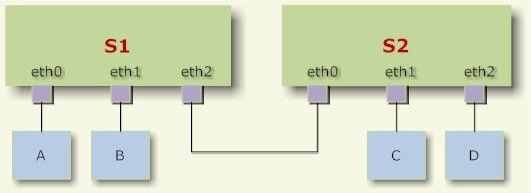
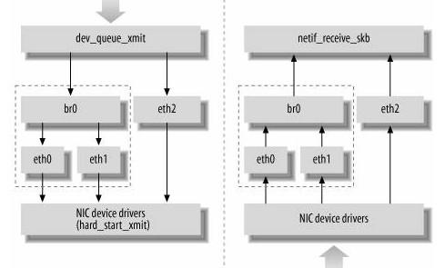

#  前言
本文的参考分析的源代码版本是2.6.15，我是边学习边总结，学习的过程中得益于Linux论坛（http://linux.chinaunix.net/bbs/）上大侠们总结分析的文档，他山之石可以攻玉，学习过程中我也会边学边总结，开源的发展在于共享，我也抛块砖，望能引到玉！
由于自身水平有限，且相关的参考资料较少，因此其中的结论不能保证完全正确，如果在阅读本文的过程中发现了问题欢迎及时与作者联系。也希望能有机会和大家多多交流学习心得！
2  网桥的原理

#   桥接的概念

简单来说，桥接就是把一台机器上的若干个网络接口“连接”起来。其结果是，其中一个网口收到的报文会被复制给其他网口并发送出去。以使得网口之间的报文能够互相转发。
交换机就是这样一个设备，它有若干个网口，并且这些网口是桥接起来的。于是，与交换机相连的若干主机就能够通过交换机的报文转发而互相通信。
如下图：主机A发送的报文被送到交换机S1的eth0口，由于eth0与eth1、eth2桥接在一起，故而报文被复制到eth1和eth2，并且发送出 去，然后被主机B和交换机S2接收到。而S2又会将报文转发给主机C、D。

交换机在报文转发的过程中并不会篡改报文数据，只是做原样复制。然而桥接却并不是在物理层实现的，而是在数据链路层。交换机能够理解数据链路层的报文，所 以实际上桥接却又不是单纯的报文转发。
交换机会关心填写在报文的数据链路层头部中的Mac地址信息（包括源地址和目的地址），以便了解每个Mac地址所代表的主机都在什么位置（与本交换机的哪 个网口相连）。在报文转发时，交换机就只需要向特定的网口转发即可，从而避免不必要的网络交互。这个就是交换机的“地址学习”。但是如果交换机遇到一个自 己未学习到的地址，就不会知道这个报文应该从哪个网口转发，则只好将报文转发给所有网口（接收报文的那个网口除外）。
比如主机C向主机A发送一个报文，报文来到了交换机S1的eth2网口上。假设S1刚刚启动，还没有学习到任何地址，则它会将报文转发给eth0和 eth1。同时，S1会根据报文的源Mac地址，记录下“主机C是通过eth2网口接入的”。于是当主机A向C发送报文时，S1只需要将报文转发到 eth2网口即可。而当主机D向C发送报文时，假设交换机S2将报文转发到了S1的eth2网口（实际上S2也多半会因为地址学习而不这么做），则S1会 直接将报文丢弃而不做转发（因为主机C就是从eth2接入的）。
然而，网络拓扑不可能是永不改变的。假设我们将主机B和主机C换个位置，当主机C发出报文时（不管发给谁），交换机S1的eth1口收到报文，于是交换机 S1会更新其学习到的地址，将原来的“主机C是通过eth2网口接入的”改为“主机C是通过eth1网口接入的”。
但是如果主机C一直不发送报文呢？S1将一直认为“主机C是通过eth2网口接入的”，于是将其他主机发送给C的报文都从eth2转发出去，结果报文就发 丢了。所以交换机的地址学习需要有超时策略。对于交换机S1来说，如果距离最后一次收到主机C的报文已经过去一定时间了（默认为5分钟），则S1需要忘记 “主机C是通过eth2网口接入的”这件事情。这样一来，发往主机C的报文又会被转发到所有网口上去，而其中从eth1转发出去的报文将被主机C收到。

#  linux的桥接实现

linux内核支持网口的桥接（目前只支持以太网接口）。但是与单纯的交换机不同，交换机只是一个二层设备，对于接收到的报文，要么转发、要么丢弃。小型 的交换机里面只需要一块交换芯片即可，并不需要CPU。而运行着linux内核的机器本身就是一台主机，有可能就是网络报文的目的地。其收到的报文除了转 发和丢弃，还可能被送到网络协议栈的上层（网络层），从而被自己消化。
linux内核是通过一个虚拟的网桥设备来实现桥接的。这个虚拟设备可以绑定若干个以太网接口设备，从而将它们桥接起来。如下图（摘自ULNI）：

网桥设备br0绑定了eth0和eth1。对于网络协议栈的上层来说，只看得到br0，因为桥接是在数据链路层实现的，上层不需要关心桥接的细节。于是协 议栈上层需要发送的报文被送到br0，网桥设备的处理代码再来判断报文该被转发到eth0或是eth1，或者两者皆是；反过来，从eth0或从eth1接 收到的报文被提交给网桥的处理代码，在这里会判断报文该转发、丢弃、或提交到协议栈上层。
而有时候eth0、eth1也可能会作为报文的源地址或目的地址，直接参与报文的发送与接收（从而绕过网桥）。

#   网桥的功能

概括来说，网桥实现最重要的两点：

*	MAC学习：学习MAC地址，起初，网桥是没有任何地址与端口的对应关系的，它发送数据，还是得想HUB一样，但是每发送一个数据，它都会关心数据包的来源MAC是从自己的哪个端口来的，由于学习，建立地址-端口的对照表（CAM表）。
*	报文转发：每发送一个数据包，网桥都会提取其目的MAC地址，从自己的地址-端口对照表(CAM表)中查找由哪个端口把数据包发送出去。
*	网桥的配置

在Linux里面使用网桥非常简单，仅需要做两件事情就可以配置了。

*	其一是在编译内核里把CONFIG_BRIDGE或CONDIG_BRIDGE_MODULE编译选项打开；
*	其二是安装brctl工具。

第一步是使内核协议栈支持网桥，第二步是安装用户空间工具，通过一系列的ioctl调用来配置网桥。下面以一个相对简单的实例来贯穿全文，以便分析代码。

Linux机器有4个网卡，分别是eth0~eth4，其中eth0用于连接外网，而eth1, eth2, eth3都连接到一台PC机，用于配置网桥。只需要用下面的命令就可以完成网桥的配置：

Brctl addbr br0 (建立一个网桥br0, 同时在Linux内核里面创建虚拟网卡br0)
Brctl addif br0 eth1
Brctl addif br0 eth2
Brctl addif br0 eth3 (分别为网桥br0添加接口eth1, eth2和eth3)

其中br0作为一个网桥，同时也是虚拟的网络设备，它即可以用作网桥的管理端口，也可作为网桥所连接局域网的网关，具体情况视你的需求而定。要使用br0接口时，必需为它分配IP地址。为正常工作，PC1, PC2，PC3和br0的IP地址分配在同一个网段。