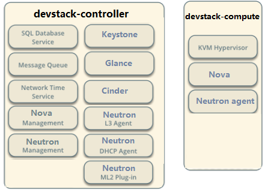

# 部署 OpenStack 环境

## 创建虚拟机

按照物理资源需求创建 devstack-controller 和 devstak-compute 虚拟机

## 安装操作系统
安装 Ubuntu 14.04，并配置 eth0 的 IP devstack-controller  192.168.104.10 devstak-compute    192.168.104.11

## 下载代码
下载 devstack 代码，并切换到 stable/liberty 分支

apt-get install git -y 

git clone https://git.openstack.org/openstack-dev/devstack -b stable/liberty

## 配置 stack 用户
创建 stack 用户

devstack/tools/create-stack-user.sh

为方便起见，将devstack目录放到/opt/stack下，并设置权限

mv devstack /opt/stack 

chown -R stack:stack /opt/stack/devstack
chmod 755 /opt/stack/ -R

## 切换到 stack 用户

su – stack 

cd devstack

> 注意切换到 stack 用户时可能出现以下问题：
> 
```
parallels@ubuntu:~/OpenStackWorkspace$ su - stack
Password:
su: Authentication failure
```
> 需要使用 ：sudo su – stack


## 创建 openstack 环境



服务部署如上所示；

## 配置文件

创建两个虚拟机，一个IP为 10.211.55.3，另外一个为 10.211.55.8；

devstack-controller

```
[[local|localrc]]

MULTI_HOST=true
HOST_IP=10.211.55.3 # management & api network
LOGFILE=/opt/stack/logs/stack.sh.log

# Credentials
ADMIN_PASSWORD=admin
MYSQL_PASSWORD=liuzebo,./
RABBIT_PASSWORD=liuzebo
SERVICE_PASSWORD=liuzebo
SERVICE_TOKEN=abcdefghijklmnopqrstuvwxyz

# enable neutron-ml2-vlan
disable_service n-net
enable_service q-svc,q-agt,q-dhcp,q-l3,q-meta,neutron,q-lbaas,q-fwaas,q-vpn
Q_AGENT=linuxbridge
ENABLE_TENANT_VLANS=True
TENANT_VLAN_RANGE=3001:4000
PHYSICAL_NETWORK=default

LOG_COLOR=False
LOGDIR=$DEST/logs
SCREEN_LOGDIR=$LOGDIR/screen
```

devstack-compute

```
[[local|localrc]]

MULTI_HOST=true
HOST_IP=10.211.55.8 # management & api network

# Credentials
ADMIN_PASSWORD=admin
MYSQL_PASSWORD=secret
RABBIT_PASSWORD=secret
SERVICE_PASSWORD=secret
SERVICE_TOKEN=abcdefghijklmnopqrstuvwxyz

# Service information
SERVICE_HOST=10.211.55.3
MYSQL_HOST=$SERVICE_HOST
RABBIT_HOST=$SERVICE_HOST
GLANCE_HOSTPORT=$SERVICE_HOST:9292
Q_HOST=$SERVICE_HOST
KEYSTONE_AUTH_HOST=$SERVICE_HOST
KEYSTONE_SERVICE_HOST=$SERVICE_HOST

CEILOMETER_BACKEND=mongodb
DATABASE_TYPE=mysql

ENABLED_SERVICES=n-cpu,q-agt,neutron
Q_AGENT=linuxbridge
ENABLE_TENANT_VLANS=True
TENANT_VLAN_RANGE=3001:4000
PHYSICAL_NETWORK=default

# vnc config
NOVA_VNC_ENABLED=True
NOVNCPROXY_URL="http://$SERVICE_HOST:6080/vnc_auto.html"
VNCSERVER_LISTEN=$HOST_IP
VNCSERVER_PROXYCLIENT_ADDRESS=$VNCSERVER_LISTEN

LOG_COLOR=False
LOGDIR=$DEST/logs
SCREEN_LOGDIR=$LOGDIR/screen
```

## 启动

在两台虚拟机上分别执行 ./stack.sh

在 devstack-controller 上输出为：

```
This is your host IP address: 10.211.55.3
This is your host IPv6 address: ::1
Horizon is now available at http://10.211.55.3/dashboard
Keystone is serving at http://10.211.55.3:5000/
The default users are: admin and demo
The password: admin
```

在 devstack-compute 上输出为：

```
This is your host IP address: 10.211.55.8
This is your host IPv6 address: ::1
2016-09-08 09:35:07.829 | stack.sh completed in 483 seconds.
```