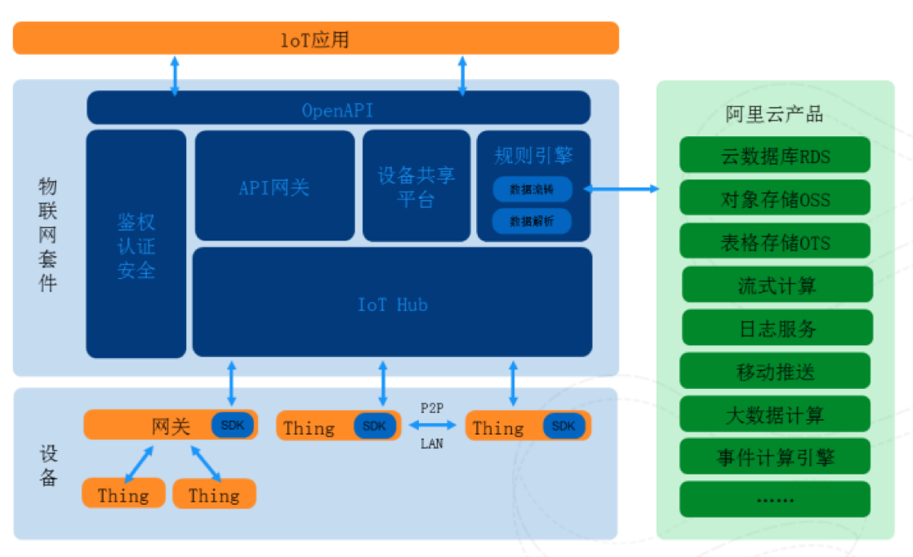

### IOT 规则引擎的介绍与实现

#### 什么是规则引擎

规则引擎起源于基于规则的专家系统，而基于规则的专家系统又是专家系统的其中一个分支。专家系统属于人工智能的范畴，它模仿人类的推理方式，使用试探性的方法进行推理，并使用人类能理解的术语解释和证明它的推理结论。

利用它就可以在应用系统中分离商业决策者的商业决策逻辑和应用开发者的技术决策，并把这些商业决策放在中心数据库或其他统一的地方，让它们能在运行时可以动态地管理和修改，从而为企业保持灵活性和竞争力提供有效的技术支持。

在需求里面我们往往把约束，完整性，校验，分支流等都可以算到业务规则里面。在规则引擎里面谈的业务规则重点是谈当满足什么样的条件的时候，需要执行什么样的操作。因此一个完整的业务规则包括了条件和触发操作两部分内容。而引擎是事物内部的重要的运行机制，规则引擎即重点是解决规则如何描述，如何执行，如何监控等一系列问题。

规则引擎由推理引擎发展而来，是一种嵌入在应用程序中的组件，实现了将业务决策从应用程序代码中分离出来，并使用预定义的语义模块编写业务决策。接受数据输入，解释业务规则，并根据业务规则做出业务决策。

#### 为什么要使用规则引擎

* 规则可以很容易地解决困难的问题，并得到解决方案的验证。与代码不同，规则以较不复杂的语言编写; 业务分析师可以轻松阅读和验证一套规则。
* 写入Drools的Rete OO算法已经是一个成熟的算法。在Drools的帮助下，您的应用程序变得非常可扩展。如果频繁更改请求，可以添加新规则，而无需修改现有规则。
* 在物联网系统中，当设备基于[Topic](https://www.alibabacloud.com/help/zh/doc-detail/73732.htm#concept-ogz-vnl-vdb)进行通信时，您可以使用规则引擎，编写SQL对Topic中的数据进行处理，并配置转发规则将处理后的数据转发到其他服务，非常方便的对设备的数据进行保存和分析。

#### 业界规则引擎方案

java开源的规则引擎有：Drools、Easy Rules、Mandarax、IBM ILOG。使用最为广泛并且开源的是Drools。

#### 规则引擎在物联网中的使用



如上图为阿里云物联网架构图，其中规则引擎把数据转发到RDS/OSS/OTS 等其他服务

#### 规则引擎的简单开发示例

本示例采用 drools 开源方案，从 kafka 消费数据，转发到其他服务，目前实现的是从 kafka 转发到 kafka，要扩展到其他服务也很简单。

* 创建规则引擎模板

```
template header

rule
eventType

package com.netease.push;

global com.netease.push.destination.DestinationManager destinationManager;
global com.netease.push.rule.Action action;

template "filter"

rule "filter_@{row.rowNumber}"
when
    m: @{eventType}(@{rule})
then
    m.setAction(action);
    destinationManager.processMessage(m);
end

end template
```

相关规则引擎语法请参见： <https://docs.jboss.org/drools/release/6.5.0.Final/drools-docs/html_single/#d0e6464>

* 解析 sql 语句，动态生成规则引擎

```
public void update(RuleMetadata ruleMetadata) {
        String sql = ruleMetadata.getSql();
        // first parse sql
        try {
            Statement statement = CCJSqlParserUtil.parse(sql);
            Select selectStatement = (Select)statement;
            TablesNamesFinder tablesNamesFinder = new TablesNamesFinder();
            List<String> tableList = tablesNamesFinder.getTableList(selectStatement);
            // just use the first table name which is kafka topic
            this.topic = tableList.get(0);
            Rule topicRule = new Rule();

            Condition topicCondition = new Condition();
            topicCondition.setField("topic");
            topicCondition.setOperator(Condition.Operator.EQUAL_TO);
            topicCondition.setValue(this.topic);

            // In reality, you would have multiple rules for different types of events.
            // The eventType property would be used to find rules relevant to the event
            topicRule.setEventType(Rule.eventType.ORDER);

            topicRule.setConditions(Arrays.asList(topicCondition));

            try {
                this.drl = applyRuleTemplate(new OnlineStatus(), topicRule);
            } catch (Exception e) {
                e.printStackTrace();
            }
        } catch (JSQLParserException e) {
            e.printStackTrace();
            return;
        }

        // second dynamic generate rule
        KieServices kieServices = KieServices.Factory.get();
        KieFileSystem kieFileSystem = kieServices.newKieFileSystem();
        kieFileSystem.write("src/main/resources/rule.drl", drl);
        kieServices.newKieBuilder(kieFileSystem).buildAll();

        KieContainer kieContainer = kieServices.newKieContainer(kieServices.getRepository().getDefaultReleaseId());
        statelessKieSession = kieContainer.getKieBase().newStatelessKieSession();

        statelessKieSession.getGlobals().set("destinationManager", destinationManager);
        statelessKieSession.getGlobals().set("action", ruleMetadata.getAction());
    }
```

```
private String applyRuleTemplate(Event event, Rule rule) throws Exception {
        Map<String, Object> data = new HashMap<String, Object>();
        ObjectDataCompiler objectDataCompiler = new ObjectDataCompiler();

        data.put("rule", rule);
        data.put("eventType", event.getClass().getName());

        return objectDataCompiler.compile(Arrays.asList(data), Thread.currentThread().getContextClassLoader().getResourceAsStream("rule-template.drl"));
    }
```


这里使用的 sqlparser 是如下库文件:

```
<dependency>
          <groupId>com.github.jsqlparser</groupId>
          <artifactId>jsqlparser</artifactId>
          <version>1.2</version>
      </dependency>
```

当前只做了简单的数据库解析，只使用了 table name；

* 应用规则引擎

从 kafka 消费到数据后，应用规则引擎，转发到 kafka

```
public void evaluate(Event event) {
        statelessKieSession.execute(event);
    }
```

至此一个简单的规则引擎开发完成，细节请参见：<https://github.com/tian-yuan/RuleEngin>